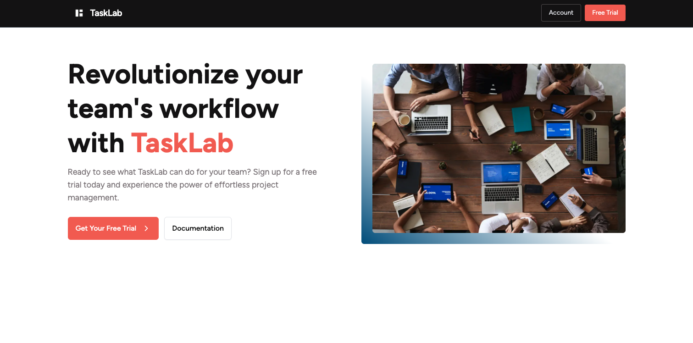
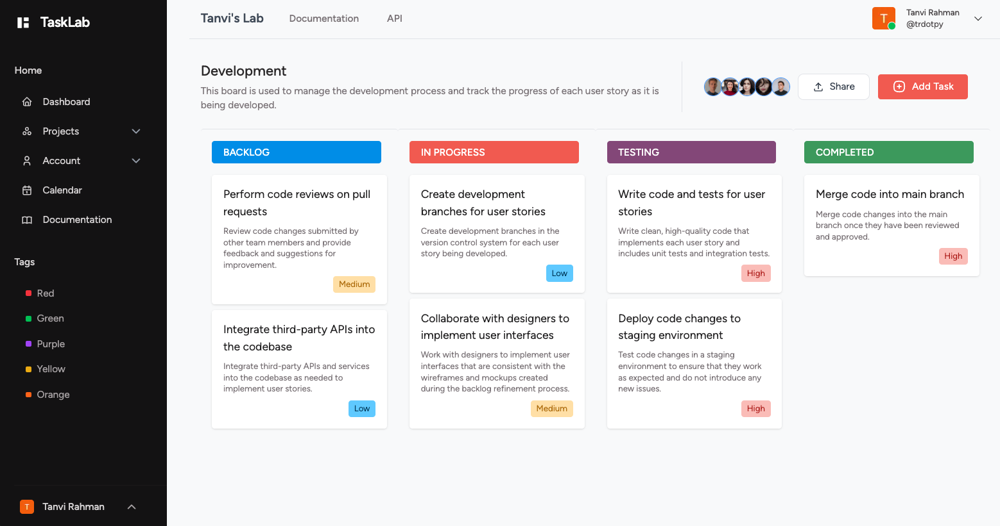

# Task Lab

### <a href="https://task-lab.vercel.app/">Live Site</a>

A lightweight project management platform, similar to JIRA.

## Tech Stack

- React
- Next.js
- Tailwind CSS
- Auth0
- MongoDB
- Mongoose

## Screenshots




## Run Locally

Clone the project

```bash
  git clone https://github.com/trdotpy/Task-Lab/
```

Go to the project directory

```bash
  cd Task-Lab
```

Install dependencies

```bash
  npm install
```

Set environment variables

```bash
  MONGODB_URI=''
  AUTH0_SECRET=''
  AUTH0_BASE_URL=''
  AUTH0_ISSUER_BASE_URL=''
  AUTH0_CLIENT_ID=''
  AUTH0_CLIENT_SECRET=''
  BASE_URL=''
```

Start the server

```bash
  npm run dev
```


## Contact

<a href="https://trdotpy.dev/">
  
</a>
<a href="https://www.linkedin.com/in/trdotpy/">
  
</a>
<a href="mailto:tanvi.rahman@outlook.com">
  
</a>
</div>

## License

[MIT](https://choosealicense.com/licenses/mit/)
